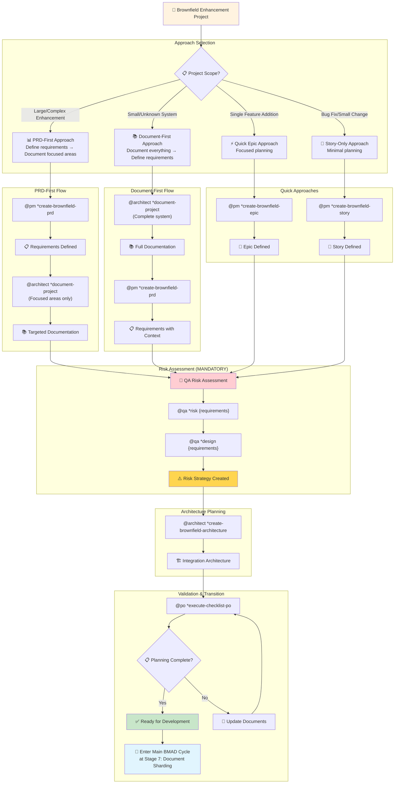
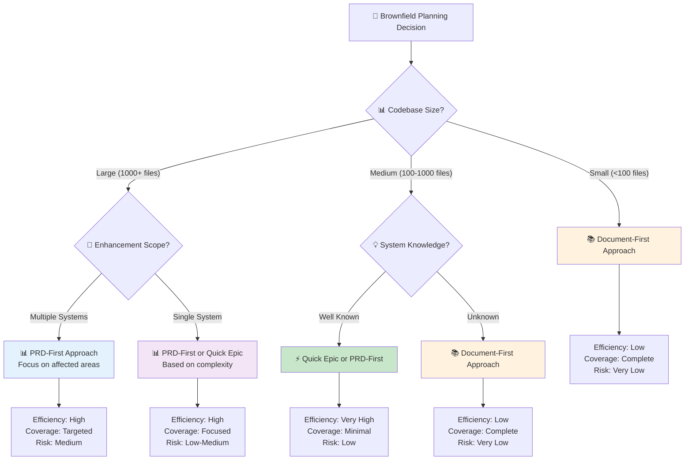
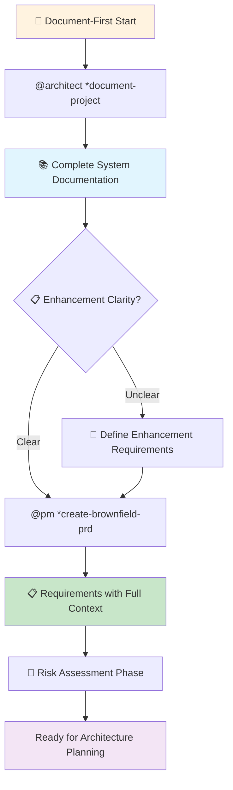
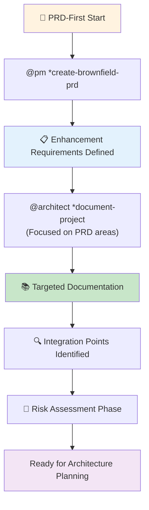
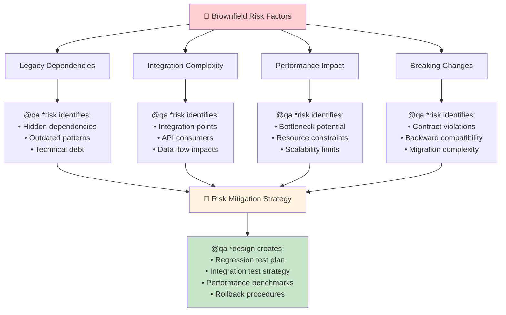
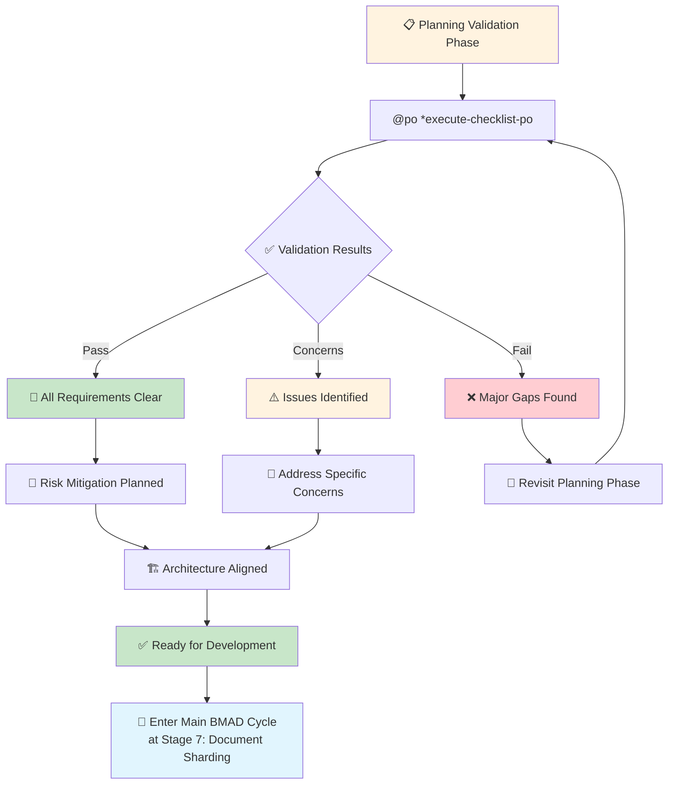

# BMAD Brownfield Planning - Comprehensive Workflow Guide

This guide focuses exclusively on the **brownfield planning phase** that occurs before entering the main BMAD development cycle. Use this for existing codebase enhancements, legacy system modernization, and feature additions to established applications.

**🔄 After Planning:** Transition to main development flow at Stage 7 (Document Sharding) in `development-flow-guide.md`

## Brownfield Planning Overview



## Part 1: Approach Selection

### Decision Framework

Choose your brownfield planning approach based on project characteristics:



### Approach Selection Table

| **Approach**       | **When to Use**                               | **Time Investment** | **Coverage** | **Risk Level** |
| ------------------ | --------------------------------------------- | ------------------- | ------------ | -------------- |
| **PRD-First**      | Large codebases, complex multi-system changes | Medium              | Targeted     | Medium         |
| **Document-First** | Unknown systems, small-medium codebases       | High                | Complete     | Very Low       |
| **Quick Epic**     | Well-defined isolated enhancements            | Low                 | Focused      | Low            |
| **Story-Only**     | Bug fixes, tiny features, urgent changes      | Very Low            | Minimal      | Variable       |

## Part 2: Document-First Workflow

**Best for:** Unknown systems, comprehensive understanding needed, exploratory changes

### Document-First Process



### Document-First Commands

```bash
# Phase 1: Complete System Documentation
@architect *document-project

# Phase 2: Define Enhancement Requirements
@pm *create-brownfield-prd

# Phase 3: Risk Assessment (Continue to Part 4)
@qa *risk {enhancement-requirements}
@qa *design {enhancement-requirements}
```

**Outputs:**

- `docs/architecture.md` - Complete system documentation
- `docs/prd.md` - Enhancement requirements with full system context
- Risk assessment and test strategy documents

## Part 3: PRD-First Workflow

**Best for:** Large codebases, well-defined enhancements, time efficiency

### PRD-First Process



### PRD-First Commands

```bash
# Phase 1: Define Enhancement Requirements
@pm *create-brownfield-prd

# Phase 2: Focused System Documentation
@architect *document-project
# PM will guide architect to focus on PRD-identified areas

# Phase 3: Risk Assessment (Continue to Part 4)
@qa *risk {prd-requirements}
@qa *design {prd-requirements}
```

**Outputs:**

- `docs/prd.md` - Clear enhancement requirements
- `docs/architecture.md` - Focused system documentation
- Risk assessment covering integration points

### Quick Approaches

#### Quick Epic Approach

```bash
@pm *create-brownfield-epic
# Use for: Well-defined, isolated enhancements
# Still requires: Risk assessment and focused documentation
```

#### Story-Only Approach

```bash
@pm *create-brownfield-story
# Use for: Bug fixes, urgent small changes
# Caution: Still run risk assessment for critical systems
```

## Part 4: Risk Assessment & QA Planning (MANDATORY)

### Why Risk Assessment is Critical for Brownfield



### Risk Assessment Commands

```bash
# MANDATORY: Risk identification and scoring
@qa *risk {brownfield-requirements}

# MANDATORY: Test strategy planning
@qa *design {brownfield-requirements}

# OPTIONAL: Early architecture review for high-risk items
@qa *early-test-architecture {high-risk-areas}
```

**Critical Risk Categories:**

- **Regression Risk** (9): High probability of breaking existing functionality
- **Integration Risk** (6-9): Complex inter-system dependencies
- **Performance Risk** (4-6): Potential for system degradation
- **Data Risk** (6-9): Complex migrations or data integrity concerns

## Part 5: Architecture Planning

### Brownfield Architecture Creation

```bash
@architect *create-brownfield-architecture {prd-and-documentation}
```

**Architecture Focus Areas:**

- **Integration Strategy** - How new code connects to existing systems
- **Migration Approach** - Gradual transition plans (strangler fig pattern)
- **Compatibility Requirements** - Backward compatibility preservation
- **Performance Considerations** - Impact on existing system performance
- **Rollback Procedures** - Safe reversion strategies

## Part 6: Validation & Transition to Development

### Planning Validation



### Transition Checklist

Before entering the main development cycle, ensure:

- [ ] **Documentation Complete** - System understanding captured
- [ ] **Requirements Clear** - Enhancement scope well-defined
- [ ] **Risks Assessed** - All regression risks identified and planned for
- [ ] **Architecture Aligned** - Integration strategy defined
- [ ] **Test Strategy Ready** - Regression and new feature test plans created
- [ ] **Rollback Plan** - Safe reversion procedures documented

### Entry Point to Main Development

**🔄 Transition Command:**

```bash
# Enter main BMAD cycle at Stage 7
@po *shard-doc prd.md docs/epics/
@po *shard-doc architecture.md docs/architecture/
```

**Continue with:** `development-flow-guide.md` from "Part 3: Core Development Cycle"

## Quick Command Reference

### Planning Phase Commands

| **Command**                       | **Purpose**                         | **When to Use**                 | **Output**             |
| --------------------------------- | ----------------------------------- | ------------------------------- | ---------------------- |
| `*document-project`               | Understand existing system          | Always first (except PRD-first) | `docs/architecture.md` |
| `*create-brownfield-prd`          | Define enhancement requirements     | Complex changes                 | `docs/prd.md`          |
| `*create-brownfield-epic`         | Quick epic planning                 | Focused enhancements            | Epic in PRD            |
| `*create-brownfield-story`        | Single story creation               | Small fixes                     | Story document         |
| `*risk {requirements}`            | **MANDATORY** regression assessment | Every brownfield project        | Risk assessment        |
| `*design {requirements}`          | **MANDATORY** test strategy         | After risk assessment           | Test design            |
| `*create-brownfield-architecture` | Integration planning                | After requirements + risks      | `docs/architecture.md` |

### Decision Quick Reference

| **Situation**           | **Recommended Approach** | **Key Commands**                               |
| ----------------------- | ------------------------ | ---------------------------------------------- |
| Large unknown codebase  | Document-First           | `*document-project` → `*create-brownfield-prd` |
| Large known codebase    | PRD-First                | `*create-brownfield-prd` → `*document-project` |
| Single feature addition | Quick Epic               | `*create-brownfield-epic`                      |
| Bug fix or tiny change  | Story-Only               | `*create-brownfield-story`                     |

**🚨 Remember:** All approaches require mandatory risk assessment (`*risk` + `*design`) before development begins.

---

This guide covers the complete brownfield planning phase. Once planning is complete, continue with the main development workflow from Stage 7 in `development-flow-guide.md`.
