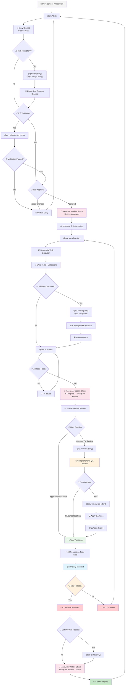

```mermaid
graph TD
    A["🏁 Development Phase Start"] --> B["@sm *draft"]
    B --> C["📝 Story Created<br/>Status: Draft"]
    C --> D{"⚠️ High-Risk Story?"}
    D -->|Yes| E["@qa *risk {story}<br/>@qa *design {story}"]
    D -->|No| F{"✅ PO Validation?"}
    E --> G["🧪 Risk & Test Strategy Created"]
    G --> F
    F -->|Yes| H["@po *validate-story-draft"]
    F -->|No| I{"👤 User Approval"}
    H --> J{"📋 Validation Passed?"}
    J -->|Yes| I
    J -->|No| K["📝 Update Story"]
    K --> B
    I -->|Approved| L["👤 MANUAL: Update Status<br/>Draft → Approved"]
    I -->|Needs Changes| K
    L --> M["git checkout -b feature/story"]
    M --> N["@dev *develop-story"]
    N --> O["💻 Sequential Task Execution"]
    O --> P["🧪 Write Tests + Validations"]
    P --> Q{"✅ Mid-Dev QA Check?"}
    Q -->|Yes| R["@qa *trace {story}<br/>@qa *nfr {story}"]
    Q -->|No| S["@dev *run-tests"]
    R --> T["📊 Coverage/NFR Analysis"]
    T --> U["💻 Address Gaps"]
    U --> S
    S --> V{"✅ All Tests Pass?"}
    V -->|No| W["🔧 Fix Issues"]
    W --> S
    V -->|Yes| X["👤 MANUAL: Update Status<br/>In Progress → Ready for Review"]
    X --> Y["✅ Mark Ready for Review"]
    Y --> Z{"👤 User Decision"}
    Z -->|Request QA Review| AA["@qa *review {story}"]
    Z -->|Approve Without QA| BB["🔍 Final Validation"]
    AA --> CC["🧪 Comprehensive QA Review"]
    CC --> DD{"🚪 Gate Decision"}
    DD -->|PASS/CONCERNS| BB
    DD -->|FAIL| EE["@dev *review-qa {story}"]
    EE --> FF["💻 Apply QA Fixes"]
    FF --> GG["@qa *gate {story}"]
    GG --> BB
    BB --> HH["✅ All Regression Tests Pass"]
    HH --> SM["@sm *story-checklist"]
    SM --> SMCheck{"📋 DoD Passed?"}
    SMCheck -->|Yes| II["📝 COMMIT CHANGES"]
    SMCheck -->|No| SMFix["🔧 Fix DoD Issues"]
    SMFix --> N
    II --> JJ{"🚪 Gate Update Needed?"}
    JJ -->|Yes| KK["@qa *gate {story}"]
    JJ -->|No| LL["👤 MANUAL: Update Status<br/>Ready for Review → Done"]
    KK --> LL
    LL --> MM["✅ Story Complete"]
    MM --> B

    style A fill:#f5f5f5
    style L fill:#fce4ec
    style X fill:#fce4ec
    style LL fill:#fce4ec
    style MM fill:#c8e6c9
    style II fill:#ffcdd2
    style CC fill:#fff3e0
    style BB fill:#e8f5e9
    style SM fill:#e1f5fe
    style SMCheck fill:#fff3e0
    style SMFix fill:#ffcdd2
```
