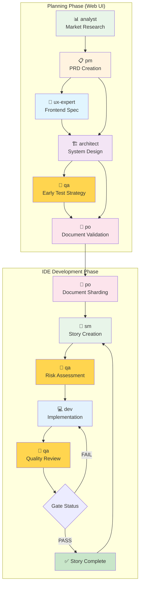
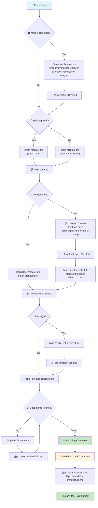
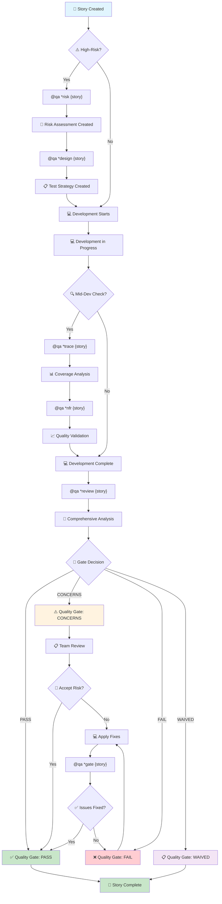
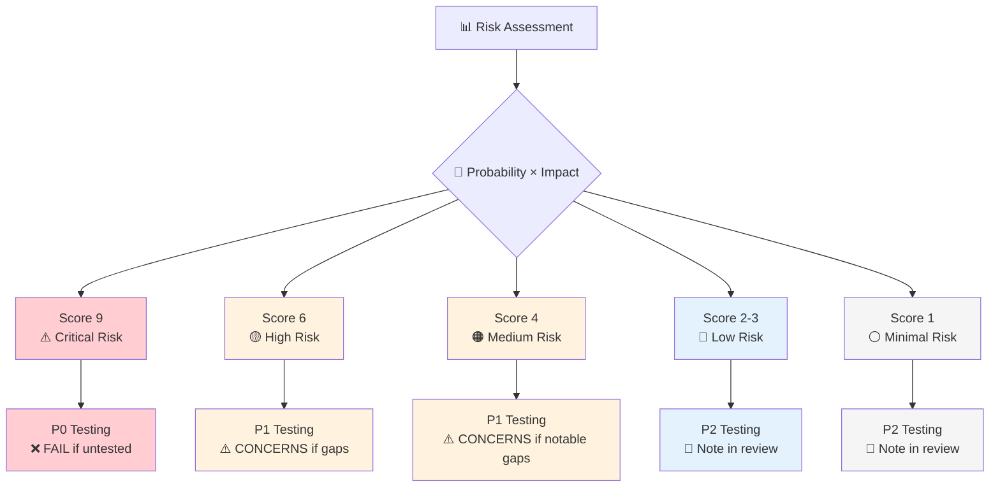
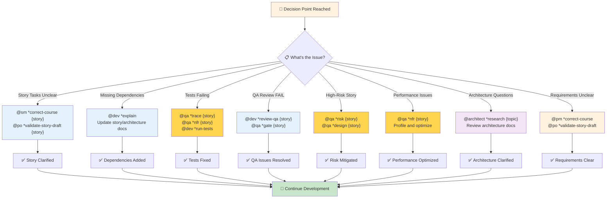

# BMAD Development Flow - Detailed Agent & Command Guide

This comprehensive guide maps every step in the BMAD Method workflow to specific agents, tasks, and commands. Use this as your practical reference for executing the BMAD process with precise instructions.

## Agent Interaction Overview



## Quick Agent Command Reference

| Agent         | Name    | Icon | Key Commands                                                   | When to Use                             |
| ------------- | ------- | ---- | -------------------------------------------------------------- | --------------------------------------- |
| **pm**        | John    | 📋   | `*create-prd`, `*shard-prd`                                    | PRD creation, product strategy          |
| **architect** | Winston | 🏗️   | `*create-full-stack-architecture`, `*shard-architecture`       | System design, technical architecture   |
| **po**        | Sarah   | 📝   | `*shard-doc`, `*validate-story-draft`, `*execute-checklist-po` | Document sharding, story validation     |
| **sm**        | Bob     | 🏃   | `*draft`, `*story-checklist`                                   | Story creation, epic management         |
| **dev**       | James   | 💻   | `*develop-story`, `*run-tests`                                 | Code implementation, development        |
| **qa**        | Quinn   | 🧪   | `*risk`, `*design`, `*trace`, `*nfr`, `*review`, `*gate`       | Quality assurance, testing strategy     |
| **ux-expert** | -       | 🎨   | `*create-frontend-spec`, `*generate-ui-prompt`                 | UI/UX design specifications             |
| **analyst**   | -       | 📊   | `*brainstorm`, `*market-research`                              | Market analysis, requirements gathering |

## Part 1: Planning Phase Workflow

### Planning Phase Overview



### Stage 1: Project Initiation

**Environment:** Web UI (Claude/Gemini/Custom GPTs) for cost efficiency

#### 1.1 Optional Market Research

```bash
@analyst *brainstorm {project-idea}
@analyst *market-research {market-segment}
@analyst *competitor-analysis {competitors}
```

**Outputs:**

- Market research documents
- Competitive analysis
- Project brief draft

#### 1.2 Product Requirements Document (PRD) Creation

```bash
# Fast track (with existing brief)
@pm *create-prd

# Interactive mode (no brief available)
@pm *create-prd
# Follow interactive prompts for detailed requirements gathering
```

**Outputs:**

- `docs/prd.md` - Complete Product Requirements Document
- Functional Requirements (FRs)
- Non-Functional Requirements (NFRs)
- Epics and initial stories

### Stage 2: UX Design (Optional)

```bash
@ux-expert *create-frontend-spec {prd-reference}
@ux-expert *generate-ui-prompt  # For Lovable/V0 integration
```

**Outputs:**

- `docs/frontend-spec.md` - UI/UX specifications
- Component wireframes
- UI generation prompts

### Stage 3: Technical Architecture

```bash
# With UX specifications
@architect *create-full-stack-architecture {prd-and-ux-spec}

# Backend only
@architect *create-backend-architecture {prd}

# Frontend only
@architect *create-front-end-architecture {prd-and-ux}
```

**Outputs:**

- `docs/architecture.md` - Complete system architecture
- Technology stack decisions
- API specifications
- Database schemas
- Infrastructure requirements

### Stage 4: Early Quality Planning (Optional)

```bash
@qa *early-test-architecture {high-risk-areas}
```

**Outputs:**

- `docs/qa/assessments/early-test-strategy-{YYYYMMDD}.md`
- Risk identification for complex features
- Test strategy recommendations

### Stage 5: Document Validation & Alignment

```bash
@po *execute-checklist-po
```

**Master Checklist Validation:**

- PRD completeness and clarity
- Architecture alignment with requirements
- Story-epic consistency
- Acceptance criteria quality
- Technical feasibility validation

**Decision Point:**

- ✅ **Aligned:** → Proceed to Stage 6
- ❌ **Not Aligned:** → Update documents and re-validate

### Stage 6: Web UI to IDE Transition

**Critical Transition Steps:**

1. **Document Transfer:** Copy `docs/prd.md` and `docs/architecture.md` to your local project
2. **IDE Setup:** Open project in your preferred Agentic IDE
3. **BMAD Installation:** `npx bmad-method install` (if not already done)

## Part 2: IDE Development Workflow

### Stage 7: Document Sharding

```bash
@po *shard-doc prd.md docs/epics/
@po *shard-doc architecture.md docs/architecture/
```

**Outputs:**

```text
docs/epics/
├── epic-1-user-authentication.md
├── epic-2-task-management.md
└── epic-3-reporting-dashboard.md

docs/architecture/
├── coding-standards.md
├── tech-stack.md
├── project-structure.md
├── api-design.md
└── database-schema.md
```

## Part 3: Core Development Cycle

### Development Cycle Overview

[Link to diagram](https://www.mermaidchart.com/app/projects/5698d526-3f59-467d-942e-dfe0b360a7a4/diagrams/235ffeee-8da1-4d88-95e7-3dca127a42a6/version/v0.1/edit)

```mermaid
graph TD
    A["🏁 Development Phase Start"] --> B["@sm *draft"]
    B --> C["📝 Story Created<br/>Status: Draft"]
    C --> D{"⚠️ High-Risk Story?"}
    D -->|Yes| E["@qa *risk {story}<br/>@qa *design {story}"]
    D -->|No| F{"✅ PO Validation?"}
    E --> G["🧪 Risk & Test Strategy Created"]
    G --> F
    F -->|Yes| H["@po *validate-story-draft"]
    F -->|No| I{"👤 User Approval"}
    H --> J{"📋 Validation Passed?"}
    J -->|Yes| I
    J -->|No| K["📝 Update Story"]
    K --> B
    I -->|Approved| L["👤 MANUAL: Update Status<br/>Draft → Approved"]
    I -->|Needs Changes| K
    L --> M["git checkout -b feature/story"]
    M --> N["@dev *develop-story"]
    N --> O["💻 Sequential Task Execution"]
    O --> P["🧪 Write Tests + Validations"]
    P --> Q{"✅ Mid-Dev QA Check?"}
    Q -->|Yes| R["@qa *trace {story}<br/>@qa *nfr {story}"]
    Q -->|No| S["@dev *run-tests"]
    R --> T["📊 Coverage/NFR Analysis"]
    T --> U["💻 Address Gaps"]
    U --> S
    S --> V{"✅ All Tests Pass?"}
    V -->|No| W["🔧 Fix Issues"]
    W --> S
    V -->|Yes| X["👤 MANUAL: Update Status<br/>In Progress → Ready for Review"]
    X --> Y["✅ Mark Ready for Review"]
    Y --> Z{"👤 User Decision"}
    Z -->|Request QA Review| AA["@qa *review {story}"]
    Z -->|Approve Without QA| BB["🔍 Final Validation"]
    AA --> CC["🧪 Comprehensive QA Review"]
    CC --> DD{"🚪 Gate Decision"}
    DD -->|PASS/CONCERNS| BB
    DD -->|FAIL| EE["@dev *review-qa {story}"]
    EE --> FF["💻 Apply QA Fixes"]
    FF --> GG["@qa *gate {story}"]
    GG --> BB
    BB --> HH["✅ All Regression Tests Pass"]
    HH --> SM["@sm *story-checklist"]
    SM --> SMCheck{"📋 DoD Passed?"}
    SMCheck -->|Yes| II["📝 COMMIT CHANGES"]
    SMCheck -->|No| SMFix["🔧 Fix DoD Issues"]
    SMFix --> N
    II --> JJ{"🚪 Gate Update Needed?"}
    JJ -->|Yes| KK["@qa *gate {story}"]
    JJ -->|No| LL["👤 MANUAL: Update Status<br/>Ready for Review → Done"]
    KK --> LL
    LL --> MM["✅ Story Complete"]
    MM --> B

    style A fill:#f5f5f5
    style L fill:#fce4ec
    style X fill:#fce4ec
    style LL fill:#fce4ec
    style MM fill:#c8e6c9
    style II fill:#ffcdd2
    style CC fill:#fff3e0
    style BB fill:#e8f5e9
    style SM fill:#e1f5fe
    style SMCheck fill:#fff3e0
    style SMFix fill:#ffcdd2
```



### Phase 1: Story Preparation (Scrum Master)

#### 3.1 Create New Development Branch

```bash
git checkout -b feature/story-name
```

#### 3.2 Story Drafting

```bash
@sm *draft
```

**Process:**

1. Reviews previous story dev/QA notes
2. Selects next epic and requirements
3. Generates detailed story from sharded epic + architecture
4. Creates story file in `docs/stories/`

**Output Example:**

- `docs/stories/epic-1.story-1-user-registration.md`

#### 3.3 High-Risk Story Assessment (Optional)

```bash
# For complex/risky stories
@qa *risk {draft-story}
@qa *design {draft-story}
```

**Outputs:**

- `docs/qa/assessments/{epic}.{story}-risk-{YYYYMMDD}.md`
- `docs/qa/assessments/{epic}.{story}-test-design-{YYYYMMDD}.md`

#### 3.4 Story Validation (Optional)

```bash
@po *validate-story-draft {story-file}
```

**Validation Checks:**

- Acceptance criteria completeness
- Architecture alignment
- Dependencies identification
- Testability assessment

#### 3.5 Story Approval

**Manual Step:** Update story status from "Draft" → "Approved"

### Phase 2: Development Implementation

#### 3.6 Story Implementation

```bash
@dev *develop-story {approved-story}
```

**Development Process:**

1. **Sequential Task Execution:**
   - Read first/next task from story
   - Implement task and subtasks
   - Write comprehensive tests
   - Execute all validations
   - Mark task complete `[x]` only when ALL pass
   - Update story File List with new/modified files
   - Repeat until all tasks complete

2. **Blocking Conditions (Dev Halts):**
   - Unapproved dependencies needed
   - Ambiguous requirements after story check
   - 3+ failures attempting same implementation
   - Missing configuration
   - Failing regression tests

#### 3.7 Mid-Development QA Checks (Optional)

```bash
# Verify test coverage during development
@qa *trace {story-in-progress}

# Validate non-functional requirements
@qa *nfr {story-in-progress}
```

**Outputs:**

- `docs/qa/assessments/{epic}.{story}-trace-{YYYYMMDD}.md`
- `docs/qa/assessments/{epic}.{story}-nfr-{YYYYMMDD}.md`

#### 3.8 Development Validation

```bash
@dev *run-tests
```

**Validation Requirements:**

- All unit tests passing
- Integration tests passing
- E2E tests passing (if applicable)
- Linting passes
- Type checking passes
- No console errors

### Phase 3: Quality Review Process

#### 3.9 Ready for Review Declaration

**Prerequisites:**

- All tasks marked complete `[x]`
- All validations passing
- Code matches requirements
- File List updated
- Dev Notes completed

**Manual Step:** Update story status to "Ready for Review"

#### 3.10 User Verification Decision Point

**Option A: Request QA Review**

```bash
@qa *review {completed-story}
```

**Option B: Approve Without QA** → Go to Phase 4

#### 3.11 Comprehensive QA Review

```bash
@qa *review {completed-story}
```

**QA Review Process:**

1. **Deep Code Analysis:**
   - Architecture pattern compliance
   - Code quality and maintainability
   - Security vulnerability scanning
   - Performance bottleneck detection

2. **Active Refactoring:**
   - Improves code directly when safe
   - Fixes obvious issues immediately
   - Suggests complex refactoring for dev

3. **Test Validation:**
   - Coverage at all levels (unit/integration/E2E)
   - Test quality (no flaky tests, proper assertions)
   - Regression test adequacy

4. **Gate Decision Creation:**
   - Updates story QA Results section
   - Creates gate file: `docs/qa/gates/{epic}.{story}-{slug}.yml`
   - Status: PASS/CONCERNS/FAIL/WAIVED

#### 3.12 QA Decision Response

**If PASS/CONCERNS:** → Proceed to Phase 4
**If FAIL:** → Return to development

```bash
@dev *review-qa {story}  # Apply QA fixes
```

#### 3.13 Gate Status Update (If Needed)

```bash
@qa *gate {story}  # Update final gate decision
```

### Phase 3.5: SM Story Validation

#### 3.13.5 Story Definition of Done Check

```bash
@sm *story-checklist {completed-story}
```

**SM Validation Process:**

- Validates story against Definition of Done checklist
- Verifies all requirements and acceptance criteria met
- Checks testing completeness and code quality
- Ensures proper documentation and story administration
- Validates build, linting, and dependencies

**Decision Point:**

- ✅ **PASS:** All DoD items complete → Proceed to commit
- ❌ **FAIL:** DoD gaps identified → Return to development with specific fixes needed

### Phase 4: Story Completion

#### 3.14 Final Validation

**Critical Verification Steps:**

- All regression tests passing
- All linting rules satisfied
- No type errors
- All acceptance criteria met
- Documentation updated
- SM Definition of Done validation passed (`@sm *story-checklist`)

#### 3.15 Commit Changes

```bash
git add .
git commit -m "feat: implement {story-description}"
```

#### 3.16 Story Completion

**Manual Steps:**

- Mark story status: "Done" (only after SM DoD validation passes)
- Add completion notes
- Update change log

**Note:** Story status updates are triggered by SM validation workflow. Manual status changes should only occur after successful `@sm *story-checklist` validation.

#### 3.17 Continue Cycle

Return to Phase 1 for next story until all features implemented.

## Part 4: Quality Gate Decisions Reference

### QA Command Flow Visualization



### QA Commands Deep Dive

| Command   | When to Use               | Output Location                                                | Priority                    |
| --------- | ------------------------- | -------------------------------------------------------------- | --------------------------- |
| `*risk`   | Before development starts | `docs/qa/assessments/{epic}.{story}-risk-{YYYYMMDD}.md`        | High for complex/brownfield |
| `*design` | After risk assessment     | `docs/qa/assessments/{epic}.{story}-test-design-{YYYYMMDD}.md` | High for new features       |
| `*trace`  | Mid-development           | `docs/qa/assessments/{epic}.{story}-trace-{YYYYMMDD}.md`       | Medium                      |
| `*nfr`    | Before review             | `docs/qa/assessments/{epic}.{story}-nfr-{YYYYMMDD}.md`         | High for critical features  |
| `*review` | Story complete            | QA Results + `docs/qa/gates/{epic}.{story}-{slug}.yml`         | **Always Required**         |
| `*gate`   | After fixes               | Updated gate file                                              | As needed                   |

### Gate Status Meanings

| Status       | Meaning                                      | Action Required         | Can Proceed?     |
| ------------ | -------------------------------------------- | ----------------------- | ---------------- |
| **PASS**     | All critical requirements met                | None                    | ✅ Yes           |
| **CONCERNS** | Non-critical issues found                    | Team review recommended | ⚠️ With caution  |
| **FAIL**     | Critical issues (security, missing P0 tests) | Must fix                | ❌ No            |
| **WAIVED**   | Issues acknowledged and accepted             | Document reasoning      | ✅ With approval |

### Risk Scoring Matrix



| Risk Score | Calculation                    | Testing Priority          | Gate Impact              |
| ---------- | ------------------------------ | ------------------------- | ------------------------ |
| **9**      | High probability × High impact | P0 - Must test thoroughly | FAIL if untested         |
| **6**      | Medium-high combinations       | P1 - Should test well     | CONCERNS if gaps         |
| **4**      | Medium combinations            | P1 - Should test          | CONCERNS if notable gaps |
| **2-3**    | Low-medium combinations        | P2 - Nice to have         | Note in review           |
| **1**      | Minimal risk                   | P2 - Minimal              | Note in review           |

## Part 5: Directory Structure Reference

### Standard BMAD Project Structure

```text
project-root/
├── docs/
│   ├── prd.md                           # Product Requirements Document
│   ├── architecture.md                  # System Architecture
│   ├── epics/                          # Sharded epics
│   │   ├── epic-1-auth.md
│   │   └── epic-2-tasks.md
│   ├── stories/                        # User stories
│   │   ├── epic-1.story-1-login.md
│   │   └── epic-1.story-2-signup.md
│   ├── architecture/                   # Sharded architecture docs
│   │   ├── coding-standards.md
│   │   ├── tech-stack.md
│   │   └── project-structure.md
│   └── qa/                            # Quality assurance artifacts
│       ├── assessments/               # QA analysis reports
│       │   ├── epic-1.story-1-risk-20240305.md
│       │   ├── epic-1.story-1-test-design-20240305.md
│       │   └── epic-1.story-1-trace-20240306.md
│       └── gates/                     # Quality gate decisions
│           └── epic-1.story-1-login.yml
├── bmad-core/                         # BMAD configuration
│   ├── agents/                        # Agent definitions
│   ├── tasks/                         # Task workflows
│   ├── templates/                     # Document templates
│   └── core-config.yaml              # Project configuration
└── src/                              # Source code (your implementation)
```

## Part 6: Troubleshooting & Best Practices

### Decision Point Flowchart



### Common Issues & Solutions

**Issue:** Story tasks are unclear or ambiguous
**Solution:**

```bash
@sm *correct-course {story}  # Refine story requirements
@po *validate-story-draft {story}  # Validate against artifacts
```

**Issue:** Development blocked by missing dependencies  
**Solution:**

```bash
@dev *explain  # Get detailed explanation of blockers
# Add dependencies to story or architecture docs
```

**Issue:** Tests failing after implementation
**Solution:**

```bash
@qa *trace {story}  # Verify test coverage
@qa *nfr {story}    # Check non-functional requirements
@dev *run-tests     # Re-run validations
```

**Issue:** QA review shows FAIL status
**Solution:**

```bash
@dev *review-qa {story}  # Apply QA recommended fixes
@qa *gate {story}        # Update gate after fixes
```

### Best Practices

1. **Always run QA risk assessment** for brownfield or complex stories
2. **Use mid-development QA checks** for critical features
3. **Keep context lean** - only load relevant files
4. **Commit frequently** during development
5. **Document decisions** in story notes and change logs
6. **Follow sequential task execution** - complete one task before starting the next

### Success Metrics

The BMAD Method with proper QA integration achieves:

- **Zero regression defects** in production
- **100% requirements coverage** with tests
- **Clear quality gates** for go/no-go decisions
- **Documented risk acceptance** for technical debt
- **Consistent test quality** across the team
- **Shift-left testing** with early risk identification

---

## Quick Command Cheat Sheet

### Planning Phase (Web UI)

```bash
@pm *create-prd                    # Create PRD
@architect *create-full-stack-architecture  # Create architecture
@po *execute-checklist-po          # Validate documents
```

### Setup Phase (IDE)

```bash
@po *shard-doc prd.md docs/epics/            # Shard PRD
@po *shard-doc architecture.md docs/architecture/  # Shard architecture
```

### Development Cycle (IDE)

```bash
@sm *draft                         # Create story
@qa *risk {story}                  # Assess risks (optional)
@qa *design {story}                # Create test strategy (optional)
@dev *develop-story {story}        # Implement story
@qa *trace {story}                 # Verify coverage (mid-dev)
@qa *nfr {story}                   # Check quality attributes (mid-dev)
@qa *review {story}                # Full QA review (required)
@sm *story-checklist {story}       # Validate DoD (required before commit)
@qa *gate {story}                  # Update gate status (if needed)
```

This document serves as your comprehensive reference for executing the BMAD Method with precision and consistency. Bookmark this guide and refer to it throughout your development workflow.
