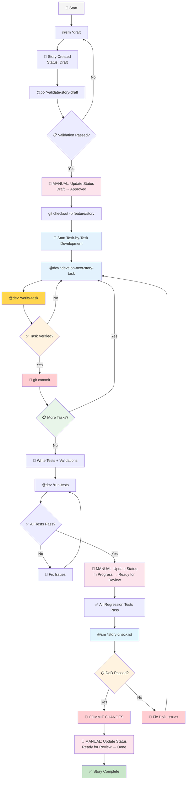

# Task-by-Task Development Flow Diagram

This diagram shows an alternative development approach using granular task-by-task execution with verification at each step.

```mermaid
graph TD
    A["🏁 Start"] --> B["@sm *draft"]
    B --> C["📝 Story Created<br/>Status: Draft"]
    C --> H["@po *validate-story-draft"]
    H --> J{"📋 Validation Passed?"}
    J -->|Yes| L["👤 MANUAL: Update Status<br/>Draft → Approved"]
    J -->|No| B
    L --> M["git checkout -b feature/story"]
    M --> N1["🎯 Start Task-by-Task Development"]
    N1 --> N2["@dev *develop-next-story-task"]
    N2 --> N3["@dev *verify-task"]
    N3 --> N4{"✅ Task Verified?"}
    N4 -->|No| N2
    N4 -->|Yes| N5["📝 git commit"]
    N5 --> N6{"📋 More Tasks?"}
    N6 -->|Yes| N2
    N6 -->|No| P["🧪 Write Tests + Validations"]
    P --> S["@dev *run-tests"]
    S --> V{"✅ All Tests Pass?"}
    V -->|No| W["🔧 Fix Issues"]
    W --> S
    V -->|Yes| X["👤 MANUAL: Update Status<br/>In Progress → Ready for Review"]
    X --> HH["✅ All Regression Tests Pass"]
    HH --> SM["@sm *story-checklist"]
    SM --> SMCheck{"📋 DoD Passed?"}
    SMCheck -->|Yes| II["📝 COMMIT CHANGES"]
    SMCheck -->|No| SMFix["🔧 Fix DoD Issues"]
    SMFix --> N2
    II --> LL["👤 MANUAL: Update Status<br/>Ready for Review → Done"]
    LL --> MM["✅ Story Complete"]

    style A fill:#f5f5f5
    style L fill:#fce4ec
    style X fill:#fce4ec
    style LL fill:#fce4ec
    style MM fill:#c8e6c9
    style II fill:#ffcdd2
    style SM fill:#e1f5fe
    style SMCheck fill:#fff3e0
    style SMFix fill:#ffcdd2
    style N1 fill:#e3f2fd
    style N2 fill:#e3f2fd
    style N3 fill:#ffd54f
    style N4 fill:#fff3e0
    style N5 fill:#ffcdd2
    style N6 fill:#e8f5e9
```
