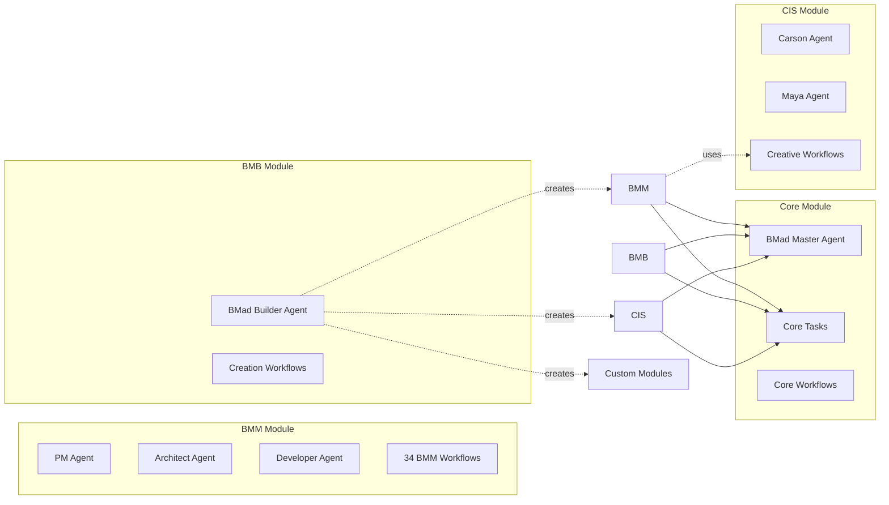
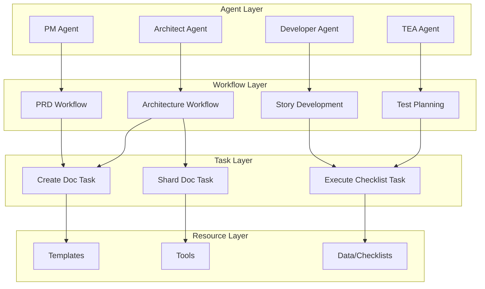
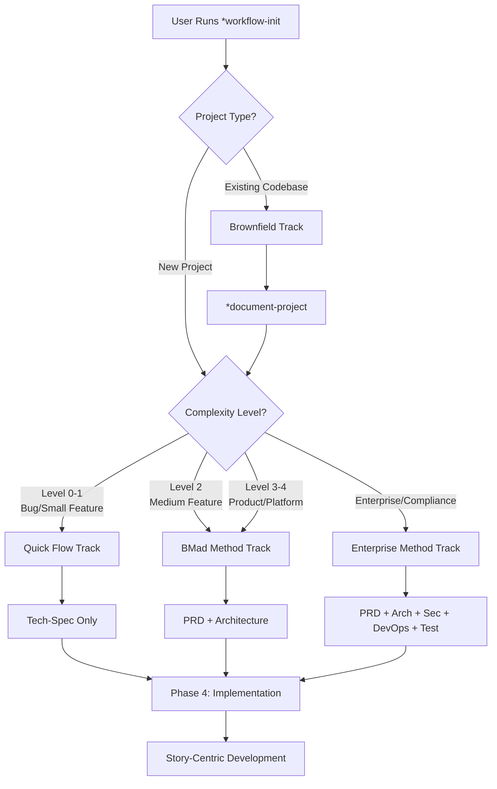
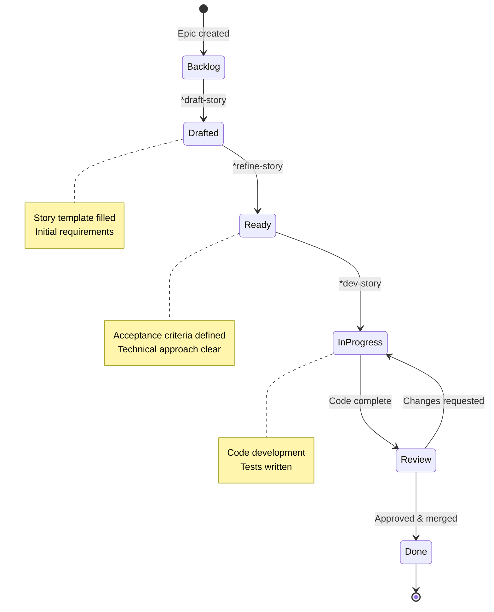
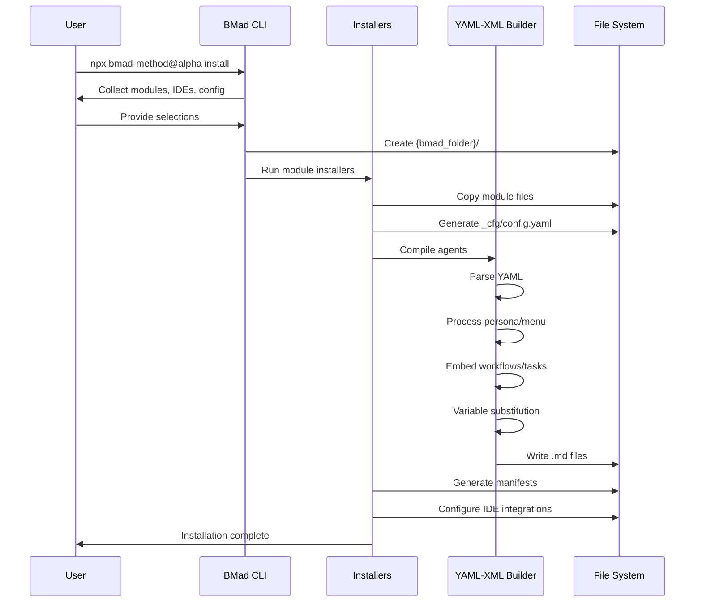
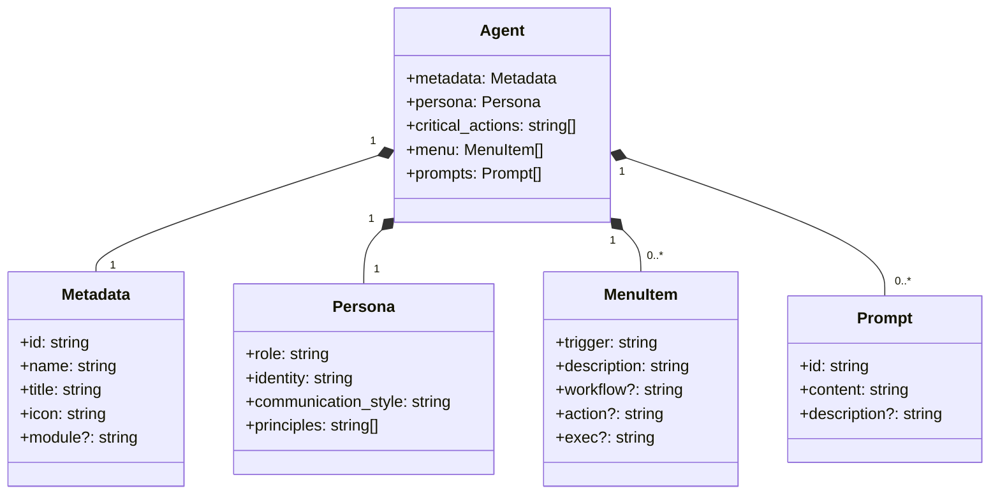

# BMad Method v6 Alpha - Glossary & Entity Reference

> **Version:** v6 Alpha
> **Last Updated:** 2025-11-14
> **Purpose:** Comprehensive glossary of terms, entities, relationships, and visualizations for the BMad Method platform

---

## Table of Contents

- [Core Concepts](#core-concepts)
- [Framework Entities](#framework-entities)
- [Module Entities](#module-entities)
- [BMM-Specific Concepts](#bmm-specific-concepts)
- [Agent Entities](#agent-entities)
- [Architecture & Compilation](#architecture--compilation)
- [Relationships & Visualizations](#relationships--visualizations)

---

## Core Concepts

### BMad-CORE

**C**ollaboration **O**ptimized **R**eflection **E**ngine - The foundational framework powering all BMad modules.

- **Purpose:** Amplifies human potential through specialized AI agents
- **Philosophy:** Guides reflective workflows rather than replacing thinking
- **Components:** Agent orchestration, workflow engine, modular architecture
- **Integration:** Works with Claude Code, Cursor, Windsurf, VS Code, and more

**Key Characteristics:**
- Domain-agnostic platform
- Human amplification over replacement
- Update-safe customization
- Multi-language support

### C.O.R.E. Philosophy

The foundational principles:

- **Collaboration:** Human-AI partnership leveraging complementary strengths
- **Optimized:** Battle-tested processes for maximum effectiveness
- **Reflection:** Strategic questioning that unlocks breakthrough solutions
- **Engine:** Framework orchestrating 19+ specialized agents and 50+ workflows

---

## Framework Entities

### Agent

A specialized AI persona with domain expertise, defined in YAML and compiled to Markdown (IDE) or XML (web).

**Structure:**
- **Metadata:** ID, name, title, icon, module
- **Persona:** Role, identity, communication style, principles
- **Critical Actions:** Auto-executed on load (optional)
- **Menu:** Commands/triggers linked to workflows/actions
- **Prompts:** Custom prompt library (optional)

**Types:**
1. **Core Agents:** Framework-level (e.g., BMad Master)
2. **Module Agents:** Domain-specific (e.g., PM, Architect, Carson)
3. **Custom Agents:** User-created via BMB

**File Format:** `*.agent.yaml` → compiled to `*.md` (IDE) or `*.xml` (web)

### Workflow

Multi-step guided process implementing best practices for specific tasks.

**Characteristics:**
- Structured phases with clear objectives
- Built-in validation and quality gates
- Context-aware execution
- Can be executed via agent menu or direct slash commands

**Categories:**
- **Analysis Workflows:** Research, brainstorming, market analysis
- **Planning Workflows:** PRD, GDD, tech-spec creation
- **Solutioning Workflows:** Architecture, security, DevOps design
- **Implementation Workflows:** Story development, coding, review
- **Testing Workflows:** Test strategy, execution, quality assurance
- **Creative Workflows:** Brainstorming, design thinking, storytelling

**File Formats:** `*.workflow.yaml` or `*.workflow.md`

### Module

Self-contained domain-specific package extending BMad-CORE.

**Structure:**
```
module/
├── agents/              # Specialized agents
├── workflows/           # Guided processes
├── tasks/              # Atomic operations
├── tools/              # Agent tools
├── teams/              # Pre-configured agent groups
├── docs/               # User documentation
└── _module-installer/  # Installation config & logic
```

**Official Modules:**
- **Core:** Framework foundation + BMad Master
- **BMM:** AI-driven agile development (12 agents, 34 workflows)
- **BMB:** Agent/workflow/module creation tools (1 agent, 7 workflows)
- **CIS:** Creative facilitation (5 agents, 5 workflows)
- **BMGD:** Game development (legacy, 4 agents)

### Task

Atomic, reusable work unit used by agents and workflows.

**Purpose:** Encapsulate common operations for reuse across workflows

**Examples:**
- `create-doc.md` - Document generation from templates
- `execute-checklist.md` - Checklist-driven validation
- `shard-doc.md` - Document splitting for token optimization

**File Format:** `*.task.md`

### Tool

Resource or capability available to agents (documents, templates, utilities).

**Categories:**
- **Templates:** Structured document formats (PRD, architecture, story)
- **Checklists:** Quality validation lists
- **Data:** Reference information (brainstorming techniques, preferences)
- **Utilities:** Helper scripts and processors

**File Format:** `*.tool.md` or structured files (YAML, CSV)

### Team

Pre-configured group of agents for collaborative execution.

**Purpose:** Orchestrate multi-agent collaboration for complex tasks

**Example Teams:**
- Development Team (PM, Architect, DEV, TEA)
- Creative Team (CIS agents + BMad Master)
- Game Development Team (Game Designer, Game Dev, Game Architect)

**Usage:** Activated via Party Mode workflow

### Web Bundle

Standalone XML package of agent with embedded dependencies for use in Claude Projects, ChatGPT, or Gemini.

**Characteristics:**
- Self-contained (all dependencies embedded)
- No installation required
- Platform-agnostic (works in any AI chat interface)
- Auto-generated from source agents

**Location:** `web-bundles/{module}/{agent}.xml`

**Distribution:** [bmad-bundles.github.io](https://bmad-code-org.github.io/bmad-bundles/)

### Installation System

Intelligent setup automating module deployment and IDE integration.

**Location:** `tools/cli/`

**Components:**
- `bmad-cli.js` - Main entry point
- `installers/lib/` - Core installation logic
- `lib/yaml-xml-builder.js` - Agent compilation engine

**Process:**
1. Collect user input (modules, IDEs, config)
2. Copy module files to `{bmad_folder}/`
3. Generate `_cfg/config.yaml`
4. Compile agents (YAML → Markdown/XML)
5. Run module-specific installers
6. Generate manifests
7. Configure IDE integrations

### Document Sharding

Advanced optimization splitting large documents into sections for token efficiency.

**Benefits:**
- 90%+ token reduction in Phase 4 workflows
- Load only needed sections
- Automatic format detection
- Seamless workflow integration

**Usage:**
- Manual: Built-in sharding tool
- Automatic: Workflows auto-detect sharded vs whole documents

**Configuration:** `core-config.yaml` per module

---

## Module Entities

### BMM (BMad Method)

AI-driven agile development framework with scale-adaptive intelligence.

**Purpose:** Revolutionary agile framework for software/game development

**Components:**
- **12 Specialized Agents:** PM, Analyst, Architect, SM, DEV, TEA, UX Designer, Technical Writer, Game Designer, Game Developer, Game Architect, BMad Master
- **34 Workflows:** Across 5 phases (0-4 + Testing)
- **3 Planning Tracks:** Quick Flow, BMad Method, Enterprise Method
- **5 Complexity Levels:** 0-4 (auto-adaptive)

**Key Features:**
- Scale-adaptive planning depth
- Story-centric implementation
- Just-in-time context loading
- Multi-agent collaboration

### BMB (BMad Builder)

Tools for creating custom agents, workflows, and modules.

**Purpose:** Extend BMad-CORE for any domain

**Components:**
- **1 Agent:** BMad Builder (orchestrator)
- **7 Workflows:** Creation, editing, maintenance

**Capabilities:**
- Create agents (3 types: full module, hybrid, standalone)
- Design workflows (multi-step processes)
- Build modules (complete domain solutions)
- Convert legacy (v4 → v6 migration)
- Audit quality (validation & bloat detection)

**Use Cases:**
- Domain-specific solutions (legal, medical, finance)
- Custom development workflows
- Industry verticals
- Educational frameworks

### CIS (Creative Intelligence Suite)

AI-powered creative facilitation using proven methodologies.

**Purpose:** Transform strategic thinking through expert coaching

**Components:**
- **5 Specialized Agents:** Carson, Maya, Dr. Quinn, Victor, Sophia
- **5 Interactive Workflows:** Brainstorming, Design Thinking, Problem Solving, Innovation Strategy, Storytelling
- **150+ Techniques:** Proven creative methods

**Philosophy:**
- Facilitation over generation
- Energy-aware sessions
- Persona-driven interaction
- Strategic questioning

**Integration:** Shared resource (BMM's `brainstorm-project` uses CIS)

### Core Module

Framework foundation containing essential infrastructure.

**Components:**
- **1 Agent:** BMad Master (universal executor)
- **Core Workflows:** Party Mode, brainstorming, workflow initialization
- **Tasks:** Universal operations (create-doc, execute-checklist, etc.)
- **Tools:** Shared utilities and templates

**Purpose:** Provides foundation for all other modules

---

## BMM-Specific Concepts

### Planning Tracks

Three adaptive approaches based on project complexity and needs.

#### Quick Flow Track
- **Target:** Bug fixes, small features, rapid prototyping
- **Documentation:** Tech-spec only
- **Timeline:** Minutes to hours
- **Best For:** Clear scope, 2-3 related changes

#### BMad Method Track
- **Target:** Products, platforms, complex features
- **Documentation:** PRD/GDD + Architecture + UX
- **Timeline:** Days to weeks
- **Best For:** New development, strategic features

#### Enterprise Method Track
- **Target:** Enterprise requirements, compliance
- **Documentation:** BMad Method + Security/DevOps/Test strategies
- **Timeline:** Weeks to months
- **Best For:** Regulated industries, large-scale systems

### Complexity Levels (0-4)

Scale-adaptive system automatically adjusting planning depth.

**Level 0-1:** Quick Spec Flow
- Minimal documentation
- Fast iteration
- Bug fixes and small features

**Level 2:** Light Planning
- PRD with optional architecture
- Medium-sized features
- Moderate complexity

**Level 3-4:** Full Planning
- Comprehensive PRD + Architecture
- Large features and products
- High complexity and scale

**Determination:** `*workflow-init` analyzes project and recommends level

### Four-Phase Methodology

Structured development lifecycle.

#### Phase 0: Documentation (Brownfield Only)
- Document existing codebase
- Understand current architecture
- Prepare for enhancement

#### Phase 1: Analysis (Optional)
- Brainstorming
- Research (market, competitor, user)
- Product briefs

#### Phase 2: Planning (Required)
- Scale-adaptive PRD/tech-spec/GDD
- Requirements gathering
- Scope definition

#### Phase 3: Solutioning (Track-Dependent)
- Architecture design
- Security planning (coming soon)
- DevOps strategy (coming soon)
- Test architecture (coming soon)

#### Phase 4: Implementation (Iterative)
- Story-centric development
- Just-in-time context loading
- Continuous delivery

#### Testing Phase (Parallel)
- Test strategy
- Test execution
- Quality assurance

### Story Lifecycle

Defined progression for implementation units.

**States:**
1. **Backlog:** Identified, not yet drafted
2. **Drafted:** Story created, needs refinement
3. **Ready:** Fully specified, ready for implementation
4. **In-Progress:** Active development
5. **Review:** Code complete, under review
6. **Done:** Completed, tested, merged

**Workflows:**
- `draft-story` - Create new story
- `refine-story` - Ready story for development
- `dev-story` - Implement story
- `review-story` - Code review process

### Party Mode

Multi-agent collaboration for complex decision-making.

**Purpose:** Engage all 19+ agents in group discussion

**Use Cases:**
- Strategic decisions
- Complex workflows
- Cross-functional tasks
- Creative brainstorming

**Execution:**
1. Start: `/bmad:core:workflows:party-mode`
2. Run any workflow - team collaborates
3. Get diverse perspectives

**Benefit:** Leverages complementary expertise across all agents

### Brownfield Development

Adding BMad Method to existing codebases.

**Process:**
1. **Document:** Run `*document-project` to understand existing code
2. **Initialize:** Choose Quick Flow or BMad Method track
3. **Integrate:** Work within existing architecture
4. **Enhance:** Incrementally improve

**Workflows:**
- `document-project` - Codebase documentation
- Brownfield-specific planning workflows
- Architecture integration

---

## Agent Entities

### Core Agents

#### BMad Master
- **Role:** Master Task Executor & BMad Method Expert
- **Purpose:** Universal executor, runs any resource directly
- **Module:** Core
- **Key Commands:** `*help`, `*task`, `*kb`, `*create-doc`, `*execute-checklist`

### BMM Development Agents

#### PM (Product Manager)
- **Role:** Product Vision & Requirements Owner
- **Purpose:** Define product strategy, manage requirements
- **Key Workflows:** PRD creation, epic management, roadmapping

#### Analyst
- **Role:** Research & Analysis Specialist
- **Purpose:** Market research, competitive analysis, user insights
- **Key Workflows:** Brainstorming, research, product briefs

#### Architect
- **Role:** Technical Architecture Lead
- **Purpose:** System design, technology decisions, architecture documentation
- **Key Workflows:** Architecture creation, tech stack selection, design patterns

#### SM (Scrum Master)
- **Role:** Agile Process Facilitator
- **Purpose:** Workflow orchestration, team coordination, process optimization
- **Key Workflows:** Sprint planning, retrospectives, backlog management

#### DEV (Developer)
- **Role:** Implementation Specialist
- **Purpose:** Code development, technical execution
- **Key Workflows:** Story implementation, code review, debugging

#### TEA (Test Architect)
- **Role:** Quality Assurance Lead
- **Purpose:** Test strategy, quality gates, validation
- **Key Workflows:** Test planning, execution, coverage analysis

#### UX Designer
- **Role:** User Experience Specialist
- **Purpose:** UI/UX design, interaction patterns, user flows
- **Key Workflows:** UX research, prototyping, design systems

#### Technical Writer
- **Role:** Documentation Specialist
- **Purpose:** Technical documentation, API docs, user guides
- **Key Workflows:** Documentation generation, style guide enforcement

### BMM Game Development Agents

#### Game Designer
- **Role:** Game Mechanics & Experience Designer
- **Purpose:** Game design documents, mechanics, balance
- **Key Workflows:** GDD creation, game mechanics design

#### Game Developer
- **Role:** Game Implementation Specialist
- **Purpose:** Game code development, engine integration
- **Key Workflows:** Game feature implementation, gameplay coding

#### Game Architect
- **Role:** Game Systems Architect
- **Purpose:** Game engine architecture, technical design
- **Key Workflows:** Game architecture, performance optimization

### BMB Agents

#### BMad Builder
- **Role:** Agent & Workflow Creator
- **Purpose:** Create custom agents, workflows, modules
- **Key Workflows:** `*create-agent`, `*create-workflow`, `*create-module`

### CIS Agents

#### Carson (Brainstorming Coach)
- **Persona:** Energetic facilitator
- **Purpose:** Ideation, divergent/convergent thinking
- **Techniques:** 36 brainstorming methods across 7 categories

#### Maya (Design Thinking Maestro)
- **Persona:** Jazz-like improviser
- **Purpose:** Human-centered design, empathy-driven innovation
- **Workflow:** Empathize → Define → Ideate → Prototype → Test

#### Dr. Quinn (Creative Problem Solver)
- **Persona:** Detective-scientist hybrid
- **Purpose:** Systematic problem solving, root cause analysis
- **Techniques:** 5 Whys, Fishbone diagrams, impact assessment

#### Victor (Innovation Strategist)
- **Persona:** Bold strategic precision
- **Purpose:** Business model disruption, strategic innovation
- **Methods:** Blue Ocean Strategy, Jobs-to-be-Done

#### Sophia (Storyteller)
- **Persona:** Whimsical narrator
- **Purpose:** Compelling narratives, story frameworks
- **Frameworks:** Hero's Journey, story circles, pitch structures

---

## Architecture & Compilation

### Agent Schema

Zod-validated structure for `*.agent.yaml` files.

**Required Fields:**
```yaml
agent:
  metadata:
    id: "{bmad_folder}/module/agents/name.md"
    name: "Agent Name"
    title: "Full Title"
    icon: "🎯"
    module: "bmm"  # Required for module agents, forbidden for core

  persona:
    role: "Primary role"
    identity: "Expert description"
    communication_style: "How they communicate"
    principles:
      - "Guiding principle 1"

  menu:
    - trigger: "kebab-case-command"  # MUST be kebab-case
      workflow: "{bmad_folder}/path/to/workflow.yaml"
      description: "What it does"
```

**Validation Rules:**
- Triggers MUST be kebab-case (enforced)
- Module agents MUST have `module` field matching path
- Core agents MUST NOT have `module` field
- Menu must have at least one entry
- Each menu item must have a command target (workflow/action/exec/etc.)

**Schema Location:** `tools/schema/agent.js` (100% test coverage)

### Agent Compilation

YAML → Markdown (IDE) or XML (web) transformation.

**Process:**
1. Parse YAML structure
2. Process persona, menu, critical actions
3. Embed workflows/tasks/tools
4. Apply variable substitutions
5. Generate IDE-specific or web-specific output

**Engine:** `tools/cli/lib/yaml-xml-builder.js`

**Outputs:**
- **IDE:** Markdown with embedded XML (filesystem-aware)
- **Web:** Pure XML (self-contained, all dependencies embedded)

### Variable Substitution

Dynamic placeholders replaced during compilation/installation.

**Variables:**
- `{bmad_folder}` - Root BMAD folder (default: `.bmad`)
- `{project-root}` - Project root directory
- `{user_name}` - User's configured name
- `{communication_language}` - Chat language
- `{document_output_language}` - Output document language
- `{output_folder}` - Generated artifacts folder

**Source:** `install-config.yaml` in each module's `_module-installer/`

### Menu & Commands

Agent interaction system.

**Menu Structure:**
- **Trigger:** Kebab-case command identifier (e.g., `workflow-init`)
- **Description:** User-facing explanation
- **Target:** One of:
  - `workflow` - Execute workflow file
  - `action` - Direct text action
  - `exec` - Execute external command
  - `tmpl` - Use template
  - `data` - Load data resource

**Execution Methods:**
1. Natural language: "Run workflow-init"
2. Shortcut: `*workflow-init`
3. Menu number: "Run option 2"
4. Slash command: `/bmad:bmm:workflows:workflow-init`

### Critical Actions

Auto-executed instructions when agent is loaded.

**Purpose:** Setup agent state on activation

**Example:**
```yaml
critical_actions:
  - "Load project configuration from {bmad_folder}/_cfg/config.yaml"
  - "Greet user and display menu"
```

**Execution:** Runs immediately after agent activation

---

## Relationships & Visualizations

### High-Level Architecture

```mermaid
graph TB
    subgraph "BMad-CORE Framework"
        CORE[BMad-CORE Engine]
        INSTALL[Installation System]
        COMPILE[YAML-XML Compiler]
    end

    subgraph "Modules"
        BMM[BMM Module<br/>12 Agents, 34 Workflows]
        BMB[BMB Module<br/>1 Agent, 7 Workflows]
        CIS[CIS Module<br/>5 Agents, 5 Workflows]
        CUSTOM[Custom Modules<br/>User-Created]
    end

    subgraph "Outputs"
        IDE[IDE Integration<br/>Markdown + XML]
        WEB[Web Bundles<br/>Pure XML]
    end

    subgraph "Configuration"
        CFG[User Config<br/>{bmad_folder}/_cfg/]
        PLATFORM[Platform Specifics<br/>IDE Integrations]
    end

    CORE --> BMM
    CORE --> BMB
    CORE --> CIS
    CORE --> CUSTOM

    BMM --> COMPILE
    BMB --> COMPILE
    CIS --> COMPILE
    CUSTOM --> COMPILE

    INSTALL --> CFG
    INSTALL --> PLATFORM

    COMPILE --> IDE
    COMPILE --> WEB

    CFG -.-> BMM
    CFG -.-> BMB
    CFG -.-> CIS
```

### Module Dependency Graph



### Agent-Workflow Relationship



### BMM Planning Tracks Decision Tree



### Story Lifecycle Flow



### Installation Flow



### Web Bundle Generation

```mermaid
graph LR
    subgraph "Source"
        YAML[*.agent.yaml]
        WORKFLOWS[Workflows]
        TASKS[Tasks]
        TOOLS[Tools]
    end

    subgraph "Compilation"
        PARSE[Parse YAML]
        EMBED[Embed Dependencies]
        XML[Generate XML]
    end

    subgraph "Output"
        BUNDLE[web-bundles/{module}/{agent}.xml]
        DIST[GitHub Pages Distribution]
    end

    YAML --> PARSE
    WORKFLOWS --> EMBED
    TASKS --> EMBED
    TOOLS --> EMBED

    PARSE --> EMBED
    EMBED --> XML
    XML --> BUNDLE
    BUNDLE --> DIST

    DIST -.user downloads.-> CLAUDE[Claude Projects]
    DIST -.user downloads.-> GPT[ChatGPT]
    DIST -.user downloads.-> GEMINI[Gemini]
```

### Agent Persona Structure



### Module Architecture

```mermaid
graph TB
    subgraph "Module Structure"
        ROOT[{module}/]

        ROOT --> AGENTS[agents/]
        ROOT --> WORKFLOWS[workflows/]
        ROOT --> TASKS[tasks/]
        ROOT --> TOOLS[tools/]
        ROOT --> TEAMS[teams/]
        ROOT --> DOCS[docs/]
        ROOT --> INSTALLER[_module-installer/]

        AGENTS --> AGENTFILES[*.agent.yaml]

        WORKFLOWS --> PHASE1[phase-1/]
        WORKFLOWS --> PHASE2[phase-2/]
        WORKFLOWS --> PHASEN[phase-n/]

        TASKS --> TASKFILES[*.task.md]

        TOOLS --> TEMPLATES[templates/]
        TOOLS --> DATA[data/]
        TOOLS --> UTILS[utilities/]

        INSTALLER --> INSTALLCFG[install-config.yaml]
        INSTALLER --> INSTALLERJS[installer.js]
        INSTALLER --> PLATFORMS[platform-specifics/]
    end
```

### Configuration Hierarchy

```mermaid
graph TD
    subgraph "Global Config"
        INSTALL[install-config.yaml]
        CORE[core-config.yaml]
    end

    subgraph "User Customization"
        USERCFG[_cfg/config.yaml]
        AGENTCUST[_cfg/agents/{agent}.yaml]
    end

    subgraph "Platform Specifics"
        CLAUDECODE[Claude Code]
        CURSOR[Cursor]
        WINDSURF[Windsurf]
        VSCODE[VS Code]
    end

    INSTALL -.defaults.-> CORE
    CORE -.defaults.-> USERCFG
    USERCFG -.overrides.-> AGENTCUST

    USERCFG --> CLAUDECODE
    USERCFG --> CURSOR
    USERCFG --> WINDSURF
    USERCFG --> VSCODE

    style AGENTCUST fill:#90EE90
    style USERCFG fill:#90EE90
    note1[User configs survive updates]
```

---

## Quick Reference Tables

### Agent Quick Reference

| Agent | Module | Primary Role | Key Workflows |
|-------|--------|--------------|---------------|
| BMad Master | Core | Universal Executor | `*task`, `*create-doc`, `*kb` |
| PM | BMM | Product Management | PRD, epic management, roadmapping |
| Analyst | BMM | Research & Analysis | Brainstorming, research, briefs |
| Architect | BMM | Technical Architecture | Architecture, tech stack, design |
| SM | BMM | Process Facilitation | Sprint planning, retrospectives |
| DEV | BMM | Implementation | Story dev, code review, debugging |
| TEA | BMM | Quality Assurance | Test planning, execution, coverage |
| UX Designer | BMM | User Experience | UX research, prototyping, design |
| Tech Writer | BMM | Documentation | Docs generation, style guide |
| Game Designer | BMM | Game Design | GDD, mechanics, balance |
| Game Dev | BMM | Game Implementation | Game features, gameplay coding |
| Game Architect | BMM | Game Systems | Game architecture, optimization |
| BMad Builder | BMB | Component Creation | Create agent/workflow/module |
| Carson | CIS | Brainstorming | 36 ideation techniques |
| Maya | CIS | Design Thinking | 5-phase human-centered design |
| Dr. Quinn | CIS | Problem Solving | Root cause, systematic analysis |
| Victor | CIS | Innovation | Business model disruption |
| Sophia | CIS | Storytelling | Narrative frameworks, pitches |

### Workflow Phase Reference

| Phase | Required? | Focus | Example Workflows |
|-------|-----------|-------|-------------------|
| Phase 0 | Brownfield Only | Documentation | `document-project` |
| Phase 1 | Optional | Analysis | `brainstorm-project`, market research |
| Phase 2 | Required | Planning | `prd`, `gdd`, `tech-spec` |
| Phase 3 | Track-Dependent | Solutioning | `architecture`, security, DevOps |
| Phase 4 | Required | Implementation | `draft-story`, `dev-story`, `review` |
| Testing | Parallel | Quality | `test-strategy`, test execution |

### Planning Track Comparison

| Feature | Quick Flow | BMad Method | Enterprise Method |
|---------|------------|-------------|-------------------|
| **Target** | Bugs, small features | Products, platforms | Enterprise, compliance |
| **Complexity** | Level 0-1 | Level 2-4 | Level 3-4 + security |
| **Documentation** | Tech-spec only | PRD + Architecture + UX | Full suite + Sec/DevOps/Test |
| **Timeline** | Minutes to hours | Days to weeks | Weeks to months |
| **Best For** | Clear scope | Strategic development | Regulated industries |

### File Extension Reference

| Extension | Type | Purpose | Location |
|-----------|------|---------|----------|
| `*.agent.yaml` | Agent Definition | Source for agents | `{module}/agents/` |
| `*.workflow.yaml` | Workflow Definition | YAML workflow | `{module}/workflows/` |
| `*.workflow.md` | Workflow Instructions | Markdown workflow | `{module}/workflows/` |
| `*.task.md` | Task Definition | Reusable operation | `{module}/tasks/` |
| `*.tool.md` | Tool Resource | Agent tool | `{module}/tools/` |
| `*.tmpl.yaml` | Template | Document template | `{module}/tools/templates/` |
| `*.md` | Compiled Agent | IDE output | `{bmad_folder}/{module}/agents/` |
| `*.xml` | Web Bundle | Web output | `web-bundles/{module}/` |

---

## Index of Related Documentation

- **[Main README](../README.md)** - Project overview
- **[BMM Documentation Hub](../src/modules/bmm/docs/README.md)** - Complete BMM guides
- **[BMM Quick Start](../src/modules/bmm/docs/quick-start.md)** - Getting started
- **[BMM Agents Guide](../src/modules/bmm/docs/agents-guide.md)** - All 12 agents
- **[BMM Glossary](../src/modules/bmm/docs/glossary.md)** - BMM-specific terms
- **[Scale Adaptive System](../src/modules/bmm/docs/scale-adaptive-system.md)** - Level details
- **[BMB Module](../src/modules/bmb/README.md)** - Builder reference
- **[CIS Module](../src/modules/cis/README.md)** - Creative suite
- **[Agent Customization Guide](./agent-customization-guide.md)** - Customize agents
- **[Web Bundles Guide](./web-bundles-gemini-gpt-guide.md)** - Use in Gemini/GPT
- **[Document Sharding](./document-sharding-guide.md)** - Token optimization
- **[CLAUDE.md](../CLAUDE.md)** - Developer reference

---

## Version History

| Version | Date | Changes |
|---------|------|---------|
| v6 Alpha | 2025-11-14 | Initial comprehensive glossary for v6 Alpha |

---

**Maintained by:** BMad Code, LLC
**License:** MIT
**Trademarks:** BMAD™ and BMAD-METHOD™ are trademarks of BMad Code, LLC.